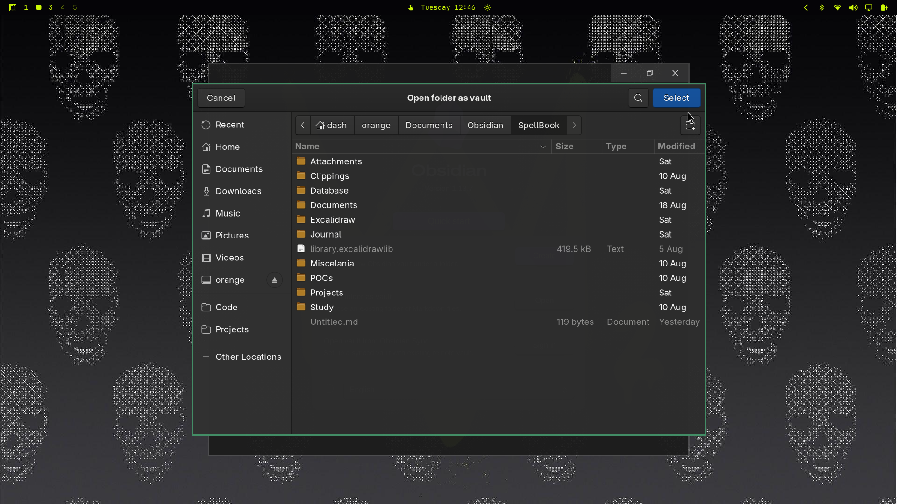

# DedSec — Omarchy Theme

> Void black #050407 + lime #CBF705 — inspired by dedsec3. Hacker, glitch, tech.



## Install

```bash
omarchy theme install https://github.com/rodriguesnich/omarchy-dedsec-theme.git
# or via menu: Super+Alt+Space > Install > Style > Theme > paste URL
```

## What it themes

- Terminal (Alacritty/Kitty/Ghostty/Foot via generated `colors.toml`)
- btop, Chromium, Hyprland, Waybar, Mako, Walker
- Omarchy Shell `bar`, `menu`, `notifications`, `OSD`, `lock` (`shell.toml` #050407/#CBF705)
- Backgrounds, icons `Yaru-olive`, `keyboard.rgb` #CBF705
- Plymouth `unlock.png` (LUKS)

## DedSec Screensaver

`DEDSEC` box art in `backgrounds/02-screensaver-dedsec.txt` + `theme-set.d` hook (`dedsec*` → `DEDSEC` via `~/.config/omarchy/branding/screensaver.txt`). Tech `ttfx` effects: `decrypt`, `matrix`, `binarypath`, `laseretch` etc. without `colorshift`.

Optional hook copy:

```bash
cp -r backgrounds/02-screensaver-dedsec.txt ~/.config/omarchy/branding/themes/dedsec.txt
# hook already included if you used dedsec3 before
```

## Updates

```bash
omarchy theme update          # git pull all .git themes
omarchy theme set dedsec
```

## Backgrounds

Cycle: `Super+Ctrl+Space` or `omarchy theme bg next`

## License

MIT
